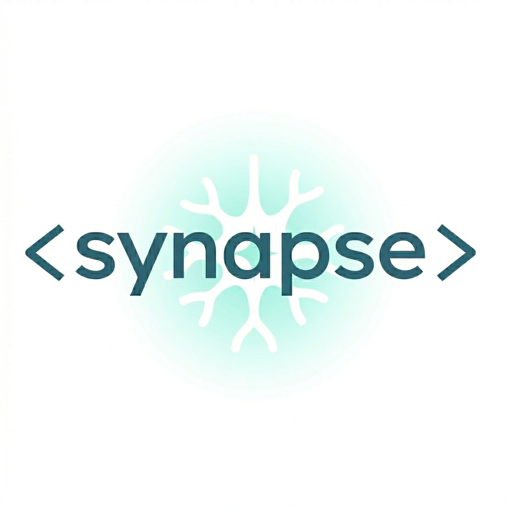

# Synapse

<div align="center">
  

  <p>
    <a href="https://opensource.org/licenses/MIT">
      
    </a>
    <a href="https://deepwiki.com/Clarit-AI/Synapse">
      
    </a>
  </p>

  <h3>Heterogeneous LLM inference for the edge</h3>
</div>

## Why Synapse?

Modern large language models demand more compute than most edge devices can comfortably deliver. On Rockchip boards such as the RK3588, that often means the CPU carries most of the load while the integrated NPU sits underused.

Synapse closes that gap. It is a high-performance fork in the `llama.cpp` family that brings together:

- The core runtime and quantization work from [ikawrakow/ik_llama.cpp](https://github.com/ikawrakow/ik_llama.cpp)
- A modernized Rockchip RKNPU2 backend derived from [KHAEntertainment/rk-llama.cpp](https://github.com/KHAEntertainment/rk-llama.cpp)
- Hybrid routing that lets CPU, CUDA, and Rockchip NPU execution coexist in one binary

By combining those pieces, Synapse can offload supported attention and dense layers to the NPU while keeping unsupported or better-suited workloads on CPU or CUDA. The goal is simple: make efficient local inference practical on real-world edge hardware.

Synapse is part of the Clarit.AI open-source ecosystem. Synapse focuses on execution and acceleration, while related projects like Engram focus on persistent state and agent workflows on constrained hardware.

## Key Features

- Rockchip RKNPU2 support for RK3588 and RK3576-class NPUs
- Hybrid CPU/NPU routing driven by deterministic manifest files
- Advanced IQK and trellis quantization inherited from `ik_llama.cpp`
- BitNet, DeepSeek, Flash Attention, and MLA-related optimizations from upstream
- Ongoing upstream sync strategy to stay close to modern `ggml` and model support
- Cross-platform CPU and CUDA support alongside Rockchip-specific acceleration

## Quick Start

### 1. Clone the repository

```bash
git clone https://github.com/Clarit-AI/Synapse.git
cd Synapse
git submodule update --init --recursive
```

### 2. Install prerequisites

On Debian or Ubuntu:

```bash
sudo apt-get update
sudo apt-get install build-essential cmake git libcurl4-openssl-dev libgomp1
```

### 3. Build for your target backend

CPU-only build:

```bash
cmake -B build -DGGML_NATIVE=ON -DCMAKE_BUILD_TYPE=Release
cmake --build build -j"$(nproc)"
```

CUDA build:

```bash
cmake -B build -DGGML_NATIVE=ON -DGGML_CUDA=ON -DCMAKE_BUILD_TYPE=Release
cmake --build build -j"$(nproc)"
```

Rockchip NPU build:

```bash
sudo apt-get install librknpu2-rk3588

cmake -B build -DGGML_NATIVE=ON -DGGML_RKNPU2=ON -DCMAKE_BUILD_TYPE=Release
cmake --build build -j"$(nproc)"
```

For backend details, see [docs/backend/RKNPU2.md](docs/backend/RKNPU2.md).

### 4. Run a model

```bash
./build/bin/llama-server \
  --model /path/to/model.gguf \
  --ctx-size 4096
```

For GPU offload, add `-ngl 999` where appropriate.

Then open [http://127.0.0.1:8080](http://127.0.0.1:8080) in your browser.

## Performance Quickstart

## Latest News


### Model Support

LlaMA-3-Nemotron [PR 377](https://github.com/ikawrakow/ik_llama.cpp/pull/377), Qwen3 [PR 355](https://github.com/ikawrakow/ik_llama.cpp/pull/355), GLM-4 [PR 344](https://github.com/ikawrakow/ik_llama.cpp/pull/344), Command-A [PR 341](https://github.com/ikawrakow/ik_llama.cpp/pull/341), bitnet-b1.58-2B-4T [PR 337](https://github.com/ikawrakow/ik_llama.cpp/pull/337), LLaMA-4 [PR 321](https://github.com/ikawrakow/ik_llama.cpp/pull/321), Gemma3 [PR 276](https://github.com/ikawrakow/ik_llama.cpp/pull/276),  DeepSeek-V3 [PR 176](https://github.com/ikawrakow/ik_llama.cpp/pull/176), Kimi-2 [PR 609](https://github.com/ikawrakow/ik_llama.cpp/pull/609), dots.llm1 [PR 573](https://github.com/ikawrakow/ik_llama.cpp/pull/573), Hunyuan [PR 565](https://github.com/ikawrakow/ik_llama.cpp/pull/565), GLM-4.5 [PR 668](https://github.com/ikawrakow/ik_llama.cpp/pull/668) (4.5/4.6/4.7/AIR), Ernie 4.5 MOE and 0.3B [PR 759](https://github.com/ikawrakow/ik_llama.cpp/pull/759), grok-2 [PR 782](https://github.com/ikawrakow/ik_llama.cpp/pull/782), Ling/Ring (Bailing-MoE2) [PR 833](https://github.com/ikawrakow/ik_llama.cpp/pull/833), Qwen3-VL [PR 883](https://github.com/ikawrakow/ik_llama.cpp/pull/883), SmolLM3 [PR 934](https://github.com/ikawrakow/ik_llama.cpp/pull/934), GigaChat3 [PR 995](https://github.com/ikawrakow/ik_llama.cpp/pull/995), ministral3 [PR 1030](https://github.com/ikawrakow/ik_llama.cpp/pull/1030), Mimo-V2-Flash [PR 1096](https://github.com/ikawrakow/ik_llama.cpp/pull/1096), GLM-4.7-Flash [PR 1168](https://github.com/ikawrakow/ik_llama.cpp/pull/1168), Seed-OSS [PR 1218](https://github.com/ikawrakow/ik_llama.cpp/pull/1218), Step-3.5-Flash [PR 1231](https://github.com/ikawrakow/ik_llama.cpp/pull/1231), GLM-5 [PR 1268](https://github.com/ikawrakow/ik_llama.cpp/pull/1268), Qwen3-Next [PR 1266](https://github.com/ikawrakow/ik_llama.cpp/pull/1266), Qwen3.5-MoE [PR 1288](https://github.com/ikawrakow/ik_llama.cpp/pull/1288) and dense Qwen-3.5 [1326](https://github.com/ikawrakow/ik_llama.cpp/pull/1326), Mistral 4 [PR 1450](https://github.com/ikawrakow/ik_llama.cpp/pull/1450), Bonsai 1-bit [PR 1570](https://github.com/ikawrakow/ik_llama.cpp/pull/1570)

### Quantization

#### Quantization additions

##### Trellis quants (`IQ1_KT`, `IQ2_KT`, `IQ3_KT`, `IQ4_KT`)

Information and the original CUDA implementation in [PR 113](https://github.com/ikawrakow/ik_llama.cpp/pull/113). Additional implementations: Metal [PR 475](https://github.com/ikawrakow/ik_llama.cpp/pull/475), Neon [PR 471](https://github.com/ikawrakow/ik_llama.cpp/pull/471), CPU [PR 441](https://github.com/ikawrakow/ik_llama.cpp/pull/441). `IQ1_KT` was added more recently in [PR 616](https://github.com/ikawrakow/ik_llama.cpp/pull/616). Note: these are base on a novel, integer-base trellis, which allows to achieve reasonable CPU performance, see [PR 529](https://github.com/ikawrakow/ik_llama.cpp/pull/529) and PRs quoted there for details. 

##### IQK quants

Information can be found in [Discussion 8](https://github.com/ikawrakow/ik_llama.cpp/discussions/8).

Initial implementations (Zen4, AVX2, NEON): `IQ5_KS_R4` [PR 426](https://github.com/ikawrakow/ik_llama.cpp/pull/426), `IQ5_KS` [PR 422](https://github.com/ikawrakow/ik_llama.cpp/pull/422), `IQ4_KS_R4` [PR 150](https://github.com/ikawrakow/ik_llama.cpp/pull/150), `IQ5_K_R4` [PR 149](https://github.com/ikawrakow/ik_llama.cpp/pull/149), `IQ2_K_R4` [PR 146](https://github.com/ikawrakow/ik_llama.cpp/pull/146), `IQ3_K_R4` [PR 145](https://github.com/ikawrakow/ik_llama.cpp/pull/145), `IQ4_K_R4` [PR 138](https://github.com/ikawrakow/ik_llama.cpp/pull/138), `IQ4_KSS` [PR 89](https://github.com/ikawrakow/ik_llama.cpp/pull/89), `IQ2_KS` [PR 85](https://github.com/ikawrakow/ik_llama.cpp/pull/85), `IQ4_KS` [PR 83](https://github.com/ikawrakow/ik_llama.cpp/pull/83), `IQ6_K` [PR 14](https://github.com/ikawrakow/ik_llama.cpp/pull/14), `IQ2_K, IQ3_K and IQ5_K` [PR 7](https://github.com/ikawrakow/ik_llama.cpp/pull/7), `IQ4_K` [PR 6](https://github.com/ikawrakow/ik_llama.cpp/pull/6)

Cuda implementations:  `IQ4_KS_R4` and `IQ5_KS_R4` [PR 493](https://github.com/ikawrakow/ik_llama.cpp/pull/493), `IQ1_S_R4` [PR 492](https://github.com/ikawrakow/ik_llama.cpp/pull/492), `IQ1_M_R4` [PR 494](https://github.com/ikawrakow/ik_llama.cpp/pull/494). `IQ4_KS_R4` and `IQ5_KS_R4` [PR 462](https://github.com/ikawrakow/ik_llama.cpp/pull/462), `IQ2_K_R4`, `IQ3_K_R4`, `IQ4_K_R4`, `IQ5_K_R4` [PR 461](https://github.com/ikawrakow/ik_llama.cpp/pull/461), `IQ4_K, IQ5_K, IQ6_K` [PR 417](https://github.com/ikawrakow/ik_llama.cpp/pull/417), `IQ2_KS, IQ2_K, IQ3_K` [PR 418](https://github.com/ikawrakow/ik_llama.cpp/pull/417)

`IQ2_KL` is a more recent addition in [PR 602](https://github.com/ikawrakow/ik_llama.cpp/pull/602) 

##### Hadamard transforms for K-cache

CPU [PR 1033](https://github.com/ikawrakow/ik_llama.cpp/pull/1033) and CUDA [PR 1034](https://github.com/ikawrakow/ik_llama.cpp/pull/1034)

##### Hadamard transforms for V-cache

[PR 1527](https://github.com/ikawrakow/ik_llama.cpp/pull/1527)

##### MXFP4 as used in gpt-oss models

Implemented for Zen4, AVX2, ARM_NEON, Metal, CUDA [PR 682](https://github.com/ikawrakow/ik_llama.cpp/pull/682) 

#### Quantization improvements

* `IQ1_M` [PR 327](https://github.com/ikawrakow/ik_llama.cpp/pull/327), `IQ2_XS` [PR 312](https://github.com/ikawrakow/ik_llama.cpp/pull/312), `Q2_K, Q4_K, Q5_K, Q4_1, Q5_1` [PR 302](https://github.com/ikawrakow/ik_llama.cpp/pull/302), `Q4_0, Q5_0, Q6_0, Q3_K, Q6_K, IQ4_XS, IQ4_NL` [PR 295](https://github.com/ikawrakow/ik_llama.cpp/pull/295)
* Low perplexity `Q4_0` KV cache [PR 1547](https://github.com/ikawrakow/ik_llama.cpp/pull/1547) [PR 1556](https://github.com/ikawrakow/ik_llama.cpp/pull/1556)

#### Quantization performance improvements 

* Much faster CPU prompt processing for all non-interleaved quants. Initial idea in [PR 515](https://github.com/ikawrakow/ik_llama.cpp/pull/515) and [PR 531](https://github.com/ikawrakow/ik_llama.cpp/pull/531), with many follow up PRs to apply to all quantization types for the 3 supported CPU platforms.
* All quantization types now have quantized matrix multiplication CUDA kernels, see [PR 557](https://github.com/ikawrakow/ik_llama.cpp/pull/515) and several others
* Faster CPU prompt processing for Trellis quants and MoE models. [PR 488](https://github.com/ikawrakow/ik_llama.cpp/pull/488)
* Trellis quants: faster CPU prompt processing [PR 482](https://github.com/ikawrakow/ik_llama.cpp/pull/482).
* Minor (~2%) `iq2_ks` TG performance improvement on CUDA [PR 468](https://github.com/ikawrakow/ik_llama.cpp/pull/468)
* Faster `IQ3_KT` and `IQ4_KT` [PR 453](https://github.com/ikawrakow/ik_llama.cpp/pull/453)
* Zen4: Faster PP for `IQ2_KS, IQ4_KS, IQ5_KS` [PR 428](https://github.com/ikawrakow/ik_llama.cpp/pull/428)
* Fast GEMM/GEMV for `IQ1_S` [PR 212](https://github.com/ikawrakow/ik_llama.cpp/pull/212)
* AVX-VNNI optimizations [PR 1446](https://github.com/ikawrakow/ik_llama.cpp/pull/1446) [PR 1455](https://github.com/ikawrakow/ik_llama.cpp/pull/1455) [PR 1467](https://github.com/ikawrakow/ik_llama.cpp/pull/1467) [PR 1474](https://github.com/ikawrakow/ik_llama.cpp/pull/1474) [PR 1482](https://github.com/ikawrakow/ik_llama.cpp/pull/1482)

### Features

* **Rockchip NPU Support**: RKNPU2 backend for acceleration on Rockchip RK3588, RK3588S, and RK3576 NPUs. See [RKNPU2 Documentation](./docs/backend/RKNPU2.md) for details.
* New split mode "graph" for multi GPU setups [PR 1022](https://github.com/ikawrakow/ik_llama.cpp/pull/1022)
* Fused delta-net for Qwen3-Next and Qwen3.5-MoE [PR 1315](https://github.com/ikawrakow/ik_llama.cpp/pull/1315) [PR 1333](https://github.com/ikawrakow/ik_llama.cpp/pull/1333) [PR 1362](https://github.com/ikawrakow/ik_llama.cpp/pull/1362) [PR 1373](https://github.com/ikawrakow/ik_llama.cpp/pull/1373)
* Hadamard transforms for K-cache and V-cache [PR 1033](https://github.com/ikawrakow/ik_llama.cpp/pull/1033) [PR 1034](https://github.com/ikawrakow/ik_llama.cpp/pull/1034) [PR 1527](https://github.com/ikawrakow/ik_llama.cpp/pull/1527)
* Auto-fit offloaded tensors to available VRAM (MoE and dense models) [PR 1501](https://github.com/ikawrakow/ik_llama.cpp/pull/1501) [PR 1504](https://github.com/ikawrakow/ik_llama.cpp/pull/1504)
* Checkpoints for recurrent models [PR 1310](https://github.com/ikawrakow/ik_llama.cpp/pull/1310) [PR 1398](https://github.com/ikawrakow/ik_llama.cpp/pull/1398)
* String ban function for all completions [PR 1185](https://github.com/ikawrakow/ik_llama.cpp/pull/1185) [PR 1243](https://github.com/ikawrakow/ik_llama.cpp/pull/1243)
* OpenAI `/v1/responses` API endpoint [PR 1184](https://github.com/ikawrakow/ik_llama.cpp/pull/1184)
* Function call support [PR 628](https://github.com/ikawrakow/ik_llama.cpp/pull/628)
* jinja template support [PR 677](https://github.com/ikawrakow/ik_llama.cpp/pull/677)
* Webui: New Features for Conversations, Settings, and Chat Messages [PR 618](https://github.com/ikawrakow/ik_llama.cpp/pull/618)
* MTP decoding support for GLM-4.x MoE [1270](https://github.com/ikawrakow/ik_llama.cpp/pull/1270)
* Self speculative decoding, ngram [PR 1261](https://github.com/ikawrakow/ik_llama.cpp/pull/1261)
* Dynamic control vector management endpoints [PR 1223](https://github.com/ikawrakow/ik_llama.cpp/pull/1223)
* Legacy quants conversion schemes in `convert_hf_to_gguf.py` [PR 449](https://github.com/ikawrakow/ik_llama.cpp/pull/449), `Q6_0` in [PR 483](https://github.com/ikawrakow/ik_llama.cpp/pull/483)
* Adaptive-P Sampler [PR 1100](https://github.com/ikawrakow/ik_llama.cpp/pull/1100) implemented as designed by it's author; supported on Webui
* Multi-modal Vision support in `llama-mtmd-cli` [PR 798](https://github.com/ikawrakow/ik_llama.cpp/pull/798) and in `llama-server` [PR 901](https://github.com/ikawrakow/ik_llama.cpp/pull/901)
* mikupad as an alternative WebUI [PR 558](https://github.com/ikawrakow/ik_llama.cpp/pull/558)
* June 8 2025: Webui updated (legacy still available when `--path ./examples/server/public_legacy` is passed) [PR 481](https://github.com/ikawrakow/ik_llama.cpp/pull/481)
* June 8 2025: RPC improvements [PR 480](https://github.com/ikawrakow/ik_llama.cpp/pull/480)
* June 7 2025: Add an endpoint that lists all the saved prompt caches to server [PR 502](https://github.com/ikawrakow/ik_llama.cpp/pull/502)
* June 6 2025: Make prompt cache saving and restoring MLA aware [PR 497](https://github.com/ikawrakow/ik_llama.cpp/pull/497)
* June 3 2025: Added samplers, XTC [PR 486](https://github.com/ikawrakow/ik_llama.cpp/pull/486), top-n σ [PR 489](https://github.com/ikawrakow/ik_llama.cpp/pull/489).
* May 22 2025: Refactor `iqk_mul_mat.cpp` which speeds up compilation time significantly. [PR 435](https://github.com/ikawrakow/ik_llama.cpp/pull/435)
* May 17 2025: Option to enable or disable the CPU FA kernels [PR 429](https://github.com/ikawrakow/ik_llama.cpp/pull/429).
* May 12 2025: User can now control if/which operations with tensors held in RAM are offloaded to the GPU. See [PR 405](https://github.com/ikawrakow/ik_llama.cpp/pull/405) 
* May 12 2025: Compatibility issues with mainline `llama.cpp` GGUFs for DeepSeek models with MLA enabled were resolved in [PR 394](https://github.com/ikawrakow/ik_llama.cpp/pull/394). The lower prompt processing performance resulting from using `llama.cpp`-style MLA GGUFs was recovered in [PR 409](https://github.com/ikawrakow/ik_llama.cpp/pull/409).
* April 21 2025: ik_llama.cpp builds and runs successfully on Android (using termux), see [PR 336](https://github.com/ikawrakow/ik_llama.cpp/pull/336)
* March 1 2025: Smart Expert Reduction for faster DeepSeek inference [PR 239](https://github.com/ikawrakow/ik_llama.cpp/pull/239) 
* Feb 25 2025: Tensor overrides for better control where model weights are stored (GPU or CPU) [PR 232](https://github.com/ikawrakow/ik_llama.cpp/pull/232)
* Feb 23 2025: `sweep-bench` - better performance benchmarking [PR 225](https://github.com/ikawrakow/ik_llama.cpp/pull/225)
* Feb 19 2025: `Q8_KV` - new type for 8-bit KV-cache quantization [PR 208](https://github.com/ikawrakow/ik_llama.cpp/pull/208)
* March 7 2025: Custom quantization mixes using regular expressions [PR 244](https://github.com/ikawrakow/ik_llama.cpp/pull/244)

### Performance improvements

* Better GPU offload strategy for MoE models when using hybrid HPU/CPU inference, see [PR 520](https://github.com/ikawrakow/ik_llama.cpp/pull/520)
* Much faster rng sampling [PR 1187](https://github.com/ikawrakow/ik_llama.cpp/pull/1187)
* May 13 2025: Better CPU FA performance for DeepSeek-Lite. [PR 410](https://github.com/ikawrakow/ik_llama.cpp/pull/410)
* May 11 2025: Slightly faster flash attention for DeepSeek models on CUDA, along with extending compatibility to Touring or newer GPUs. [PR 408](https://github.com/ikawrakow/ik_llama.cpp/pull/408)
* May 4 2025: Significant token generation performance improvement on CUDA with Flash Attention for GQA models. For details and benchmarks. [PR 370](https://github.com/ikawrakow/ik_llama.cpp/pull/370) 
* April 17 2025: Better CPU Flash Attention token generation performance. [PR 332](https://github.com/ikawrakow/ik_llama.cpp/pull/332)
* April 3 2025: Much faster MoE implementation on Metal. [PR 307](https://github.com/ikawrakow/ik_llama.cpp/pull/307) 
* March 25 2025: Better MoE performance on CUDA [PR 283](https://github.com/ikawrakow/ik_llama.cpp/pull/283)
* March 23 2025: Better batched processing speed for DeepSeek models [PR 282](https://github.com/ikawrakow/ik_llama.cpp/pull/282)
* March 18 2025: Reduce compute buffer size [PR 237](https://github.com/ikawrakow/ik_llama.cpp/pull/237)
* March 10 2025: Better TG performance for MoE models on CUDA [PR 248](https://github.com/ikawrakow/ik_llama.cpp/pull/248)
* Feb 23 2025: Fused FFN ops for faster MoE inference [PR 229](https://github.com/ikawrakow/ik_llama.cpp/pull/229)

### Flash-MLA

* May 7 2025: 🚀 FlashMLA-3 for DeepSeek models on CUDA. [PR 386](https://github.com/ikawrakow/ik_llama.cpp/pull/386). Caveat: Ampere or newer Nvidia GPU required
* March 21 2025: 🚀 FlashMLA-3: fastest CPU-only inference for DeepSeek models [PR 273](https://github.com/ikawrakow/ik_llama.cpp/pull/273)
* March 17 2025: 🚀 FlashMLA-2 performance improvements [PR 253](https://github.com/ikawrakow/ik_llama.cpp/pull/253)
* March 12 2025: Allow `Q8_0` KV cache with FlashMLA-2 on CUDA [PR 265](https://github.com/ikawrakow/ik_llama.cpp/pull/265)
* March 9 2025: 🚀 FlashMLA on CUDA [PR 247](https://github.com/ikawrakow/ik_llama.cpp/pull/247)
* March 8 2025: 🚀 Faster FlashMLA CPU implementation [PR 243](https://github.com/ikawrakow/ik_llama.cpp/pull/243)
* March 3 2025: 🚀 Introducing FlashMLA - MLA with Flash Attention [PR 240](https://github.com/ikawrakow/ik_llama.cpp/pull/240)
* Feb 27 2025: MLA without transposed cache [PR 235](https://github.com/ikawrakow/ik_llama.cpp/pull/235)
* Feb 13 2025: Allow `Q8_0` quantized cache with MLA [PR 206](https://github.com/ikawrakow/ik_llama.cpp/pull/206)
* Feb 11 2025: 🚀 Flash Attention support for DeepSeek models [PR 200](https://github.com/ikawrakow/ik_llama.cpp/pull/200)
* Feb 9 2025: 🚀 MLA for DeepSeek models [PR 188](https://github.com/ikawrakow/ik_llama.cpp/pull/188)

### Fixes

* Fix bug in MMVQ kernel [PR 446](https://github.com/ikawrakow/ik_llama.cpp/pull/446)
* Fix AVX2 implementation of `IQ4_K, IQ4_KS, IQ5_K, IQ6_K` [PR 427](https://github.com/ikawrakow/ik_llama.cpp/pull/427) 
* Fix standard attention on the CPU [PR 421](https://github.com/ikawrakow/ik_llama.cpp/pull/421) 
* Fix imatrix calculation for MLA models [PR 411](https://github.com/ikawrakow/ik_llama.cpp/pull/411)
* Fix new CUDA FA on Touring [PR 413](https://github.com/ikawrakow/ik_llama.cpp/pull/413)
* Fix SER. CPU: [PR 415](https://github.com/ikawrakow/ik_llama.cpp/pull/415) CUDA: [PR 416](https://github.com/ikawrakow/ik_llama.cpp/pull/416)

## Resources

There is no single point of reference describing all new `ik_llama.cpp` features. Pull requests often contain detailed information, so browsing the PRs is often the best way to learn about new features and how to use them. In addition
* [The Wiki page](https://github.com/ikawrakow/ik_llama.cpp/wiki) has performance comparisons to mainline `llama.cpp`
* [This guide](https://github.com/ikawrakow/ik_llama.cpp/discussions/258) is a good place to start if you came here because of DeepSeek models
* [This discussion](https://github.com/ikawrakow/ik_llama.cpp/discussions/266) is about running DeepSeek-V3/R1 on a 16 x 3090 setup
* [This discussion](https://github.com/ikawrakow/ik_llama.cpp/discussions/8) describes the new quantization types available in `ik_llama.cpp`

## Testing

### Function Calls Tests

To run the function calls test suite:

The fastest setup depends on your hardware and model family, but a strong CPU baseline looks like this:

```bash
./build/bin/llama-server \
  --model /path/to/model.gguf \
  --ctx-size 4096 \
  -t "$(nproc)" \
  -fa \
  -fmoe \
  -ctk q8_0 -ctv q8_0 \
  -b 2048 -ub 2048 \
  -rtr \
  -mla 3
```

Those flags enable Flash Attention, fused MoE kernels, quantized KV cache, larger batches, runtime repacking, and MLA support where available.

> **Not sure whether CPU, NPU, or Hybrid is best for your model?** Ask DeepWiki for a recommended starting point, then benchmark CPU, NPU, and Hybrid performance on your device.

For a fuller tuning guide, see [docs/cpu-arm-optimization.md](docs/cpu-arm-optimization.md).

## Hybrid CPU + NPU Mode

Hybrid mode lets you route supported tensors to the Rockchip NPU while keeping the rest on CPU. The simplest way to get started is to use one of the example manifests in [examples/hybrid-manifests](examples/hybrid-manifests):

- `dense-balanced.json`
- `dense-npu-heavy.json`
- `moe-balanced.json`

Example:

```bash
./build/bin/llama-server \
  --model /path/to/model.gguf \
  --hybrid-manifest examples/hybrid-manifests/dense-balanced.json \
  --ctx-size 4096 \
  -fa -fmoe -ctk q8_0 -ctv q8_0 -b 2048 -ub 2048 -rtr
```

If you want startup to fail instead of silently falling back when the manifest cannot be satisfied, add `--hybrid-strict`.

You can also place a sidecar manifest next to the model and point Synapse at it explicitly with `--hybrid-manifest`.

## Notes & Warnings

### Supported Backends

The only fully functional and performance-focused compute backends in Synapse are:

- CPU (`AVX2` or better, `ARM_NEON` or better)
- CUDA
- Rockchip NPU (via `RKNPU2`)

Metal support is inherited from upstream and may work, but it is not currently a primary optimization target.

Please do not open issues for ROCm, Vulkan, or other backends unless you are actively contributing to bring them up to speed.

### Quantized Model Warning

Do not use quantized models from Unsloth that have `_XL` in their name unless you know they do not contain `f16` tensors.

To be precise: the `_XL` variants most likely to fail are the ones that include `f16` tensors. Models without those tensors are generally fine.

### Partial Offload and Graph Mode Warning

Some users have reported gibberish or incoherent output when using graph parallel mode (split mode `graph`) or partial GPU offload configurations such as:

- `--cpu-moe`
- `--n-cpu-moe`
- tensor override workflows

If you run into that behavior, try:

```bash
-cuda graphs=0
```

## Upstream Sync Status

| Component | Source | Sync Frequency |
| --- | --- | --- |
| CPU / Quantization | `ik_llama.cpp` | Weekly |
| Rockchip NPU | `rk-llama.cpp` | As needed |
| GGML Core | upstream `llama.cpp` via `ik` tracking | Indirect / inherited |

## Architecture Overview

Synapse is organized around three major layers:

- `ggml` core: the tensor runtime and model loading foundation
- Core runtime: CPU and CUDA kernels, quantization logic, and CLI behavior inherited primarily from `ik_llama.cpp`
- RKNPU2 backend: Rockchip-specific execution, routing, and compatibility work for modern `ggml`

That structure allows Synapse to stay close to upstream performance work while still evolving a dedicated hybrid path for Rockchip edge devices.

## Benchmarks and Tuning Resources

- [docs/cpu-arm-optimization.md](docs/cpu-arm-optimization.md) for CPU and hybrid runtime tuning
- [docs/backend/RKNPU2.md](docs/backend/RKNPU2.md) for Rockchip backend details
- [docs/prompts/rock5/README.md](docs/prompts/rock5/README.md) for RK3588 and Rock 5 benchmarking workflows
- [docker/README.md](docker/README.md) for container-based setup
- [docs/parameters.md](docs/parameters.md) for CLI flags and runtime options

## Contributing

Contributions are welcome. If you are improving hardware support, quantization, manifests, or documentation, open an issue or pull request and include enough detail for someone else to reproduce your environment and results.

General contribution guidance lives in [CONTRIBUTING.md](CONTRIBUTING.md).

## License

Synapse is released under the MIT license. See [LICENSE](LICENSE) for details.

## Acknowledgements

Synapse stands on the work of several upstream projects and communities:

- [ikawrakow/ik_llama.cpp](https://github.com/ikawrakow/ik_llama.cpp) for the performance-focused runtime, quantization, and CPU/CUDA optimization work
- [KHAEntertainment/rk-llama.cpp](https://github.com/KHAEntertainment/rk-llama.cpp) and earlier Rockchip integration efforts for the original RKNPU2 backend direction
- [rockchip-linux/rknpu2](https://github.com/rockchip-linux/rknpu2) for Rockchip's runtime and low-level NPU support
- [rockchip-linux/rknn-toolkit2](https://github.com/rockchip-linux/rknn-toolkit2) for model conversion workflows required for NPU execution

Their work makes modern local inference on constrained hardware much more practical.
